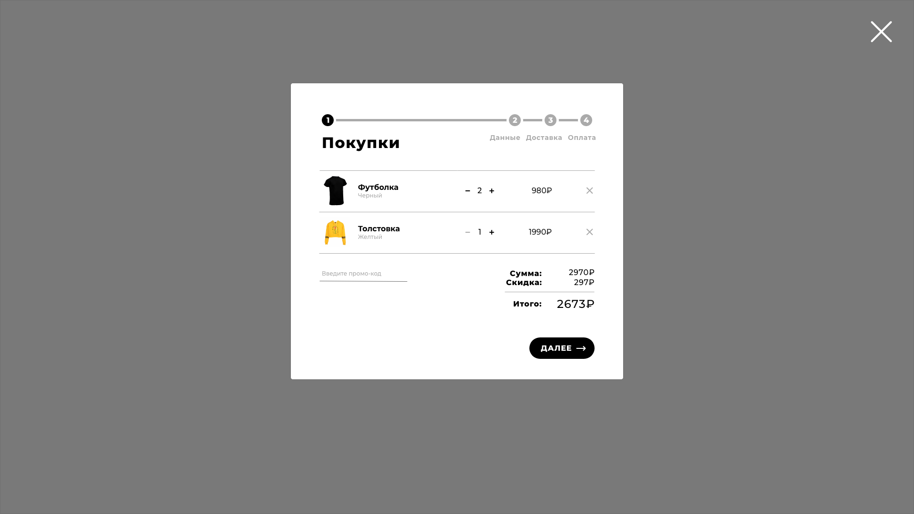
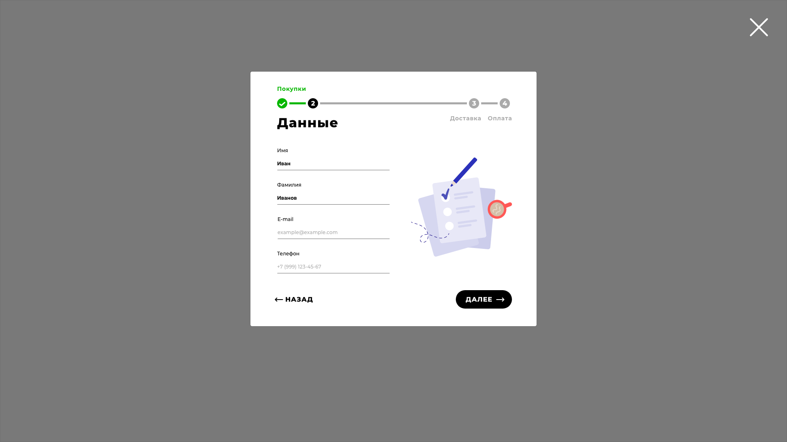
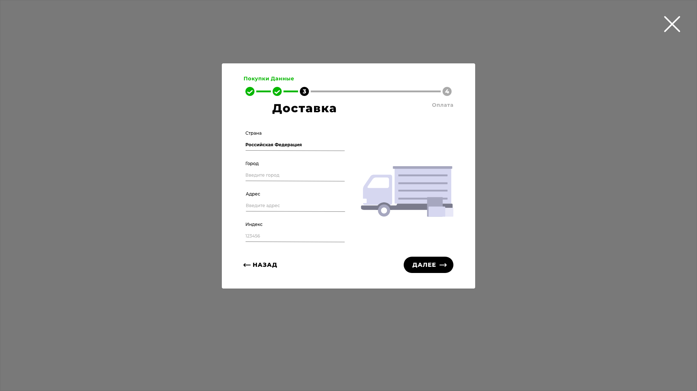
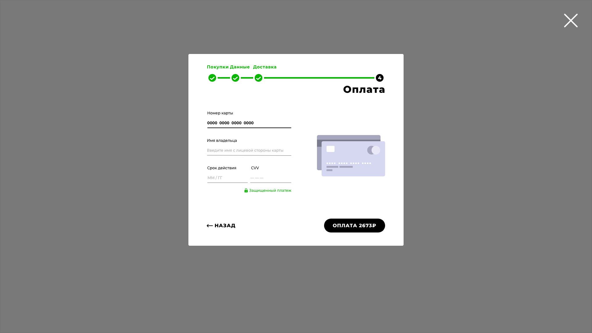
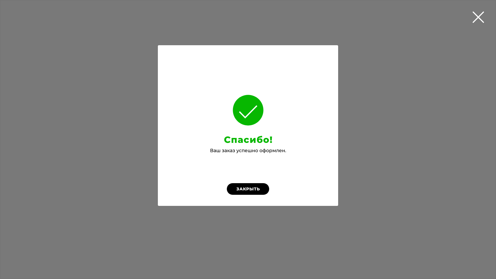

# Корзина для интернет-магазина
Интерактивное демо доступно на GitHub Pages: https://eugenekx.github.io/

## Краткое описание задачи
Реализовать интерактивное демо корзины без использования CSS и JS фреймворков.
Дополнительно, процесс покупки может быть разбит на четыре этапа:
* проверка состава заказа,
* данные покупателя,
* доставка,
* выбор способа оплаты.

## Исследование существующих решений
При выполнении задания было проведено исследование уже существующих решений на Dribbble и Behance. Макеты для страниц со списком товаров и оплатой можно условно разделить на два типа:
* Макеты с разбивкой процесса покупки на этапы, 
* Одностраничные макеты.

С целью учесть пожелание к выполнению задания (четыре этапа) и разгрузить интерфейс покупки товара, в рамках выполнения задания был выбран вариант с разбивкой процесса покупки на этапы.

Для того, чтобы наглядно отобразить процесс продвижения пользователя от проверки состава заказа к завершению заказа, используются следующие элементы интерфейса:
* вкладки,
* список этапов,
* интерактивная карта этапов.

Для выполнения данного задания был выбран вариант с интерактивной картой этапов, как наиболее наглядный способ отобразить состояние оформления заказа. 

## Особенности предлагаемого решения

Логически процесс оформления заказа хорошо описывается концепцией Wizard, так как действия логически целостно объединяются в последовательную цепочку шагов, навигация по которым происходит при помощи действий "переместиться назад" и "переместиться вперед".

С целью повысить конверсию магазинов, предлагается ввести возможность использования промо-кодов, поле для ввода которых доступно на первом этапе оформления заказа.

Так как предполагаемое окружение для этого макета -- конструктор сайтов, при разработке макета сделан акцент на простоте, нейтральности и универсальности дизайна.

## Макеты экранов

